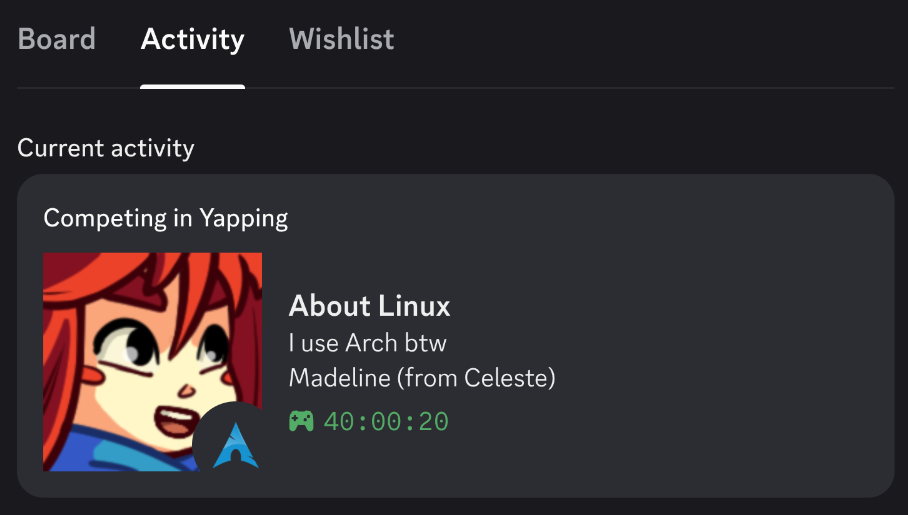

# custom-rpc

Set custom Discord Rich Presence via Remote Procedure Calls.



> [!NOTE]
> When the activity type is 5 (Competing in), the activity name is placed in the "Competing in {name}" string, the details field replaces the name in the bolded title, and the state field is just below. The third line is, for whatever reason, filled in with the large image hover text.
> If the activity type is changed to 0 (Playing), the bold title would be "Yapping", and the two lines below would contian the details and state fields, respectively, and the large image hover text would only appear when hovering over the large image.

## Usage

## Bare minimum

Clone the repo, install dependencies, copy and edit the config file, and run the app. Simple.

```bash
git clone https://github.com/ackledotdev/custom-rpc.git # gh repo clone ackledotdev/custom-rpc
cd custom-rpc
npm i
cp example.jsonc config.jsonc # Copy the example config file
vi config.jsonc # Edit as desired
npm start
```

> [!IMPORTANT]
> Running the app with the default config file will produce something similar to the sample image, assuming that is up-to-date.
> You must edit the config file and specify your own Client ID from the Discord Developer Portal to add your own images. See "Advanced setup". If you are not using images, this will not be necessary, but you must comment out the image section to hide the images.

## Advanced setup

1. Create an application on the [Discord Developer Portal](https://discord.com/developers/applications) and copy the Client/Application ID. No other fields need to be changed. They will not affect the Rich Presence.
2. Enter your Client ID in the config file.
3. Upload images to the Rich Presence art assets tab of your application settings. Ensure the images are keyed properly before saving.
4. In the config file, update the image keys to match the keys of the uploaded images. Edit hover text as desired.
5. Run the app with `npm start`.

## Watching for config changes

Add the `watch` argument to watch the config file for changes and automatically refresh the Rich Presence without restarting the app.

```bash
npm start -- watch
```

> [!NOTE]
> The `-- watch` is not a typo; the double dash separates npm args from the args passed to the script.

> [!IMPORTANT]
> The `refreshTime` value in the config file is only read on initial startup; to accept a new value, the app _must_ be restarted.

## Systemd

A sample systemd user unit file is provided.

```bash
cp custom-rpc.service ~/.config/systemd/user/ # copy the service file
vi ~/.config/systemd/user/custom-rpc.service # edit the ExecStart path to point to your installation

systemctl --user enable --now custom-rpc.service # enable the service to start on login if desired
# or
systemctl --user start custom-rpc.service # start the service now
```

Optionally, edit the `ExecStart` line to include the `watch` argument to refresh config changes without restarting the service.

```ini
ExecStart=/usr/bin/npm start --prefix=/path/to/git/custom-rpc -- watch
```

However, this will create a file watcher that scans continuously for updates. The service can always be refreshed manually with `systemctl --user restart custom-rpc.service` after editing the config file. ~~Note that the `refreshTime` value is only read on initial startup; to accept a new value, the service _must_ be restarted.~~ That is no longer the case. `refreshTime` is handled on config reload.

## Config hotswitch

Configs can be switched on the fly by starting the process with the `watch` argument in either the CLI or systemd unit file. Instead of editing the config file, create multiple config files and copy the desired config to `config.jsonc`.

```bash
cp example.jsonc config.jsonc # switch to example.jsonc
cp /home/user/another_config.jsonc config.jsonc # switch to another_config.jsonc
echo '{}' > config.jsonc # clear Rich Presence
echo '' > config.jsonc # another way to clear Rich Presence
```

The app will detect the change and reload the new config automatically. An empty config file or one containing an empty object (`{}`) will disconnect from the Rich Presence server without terminating the app.

- File watch mode must be enabled.
- It is imperative that the file exists the entire time the app is running; deleting the file will cause the program to terminate with an error. An empty config file will allow the program to keep watching but clear the Rich Presence.
- The config loaded at startup **must** have the correct Client ID for the Discord application; changing the Client ID on the fly is not supported and will be ignored.
